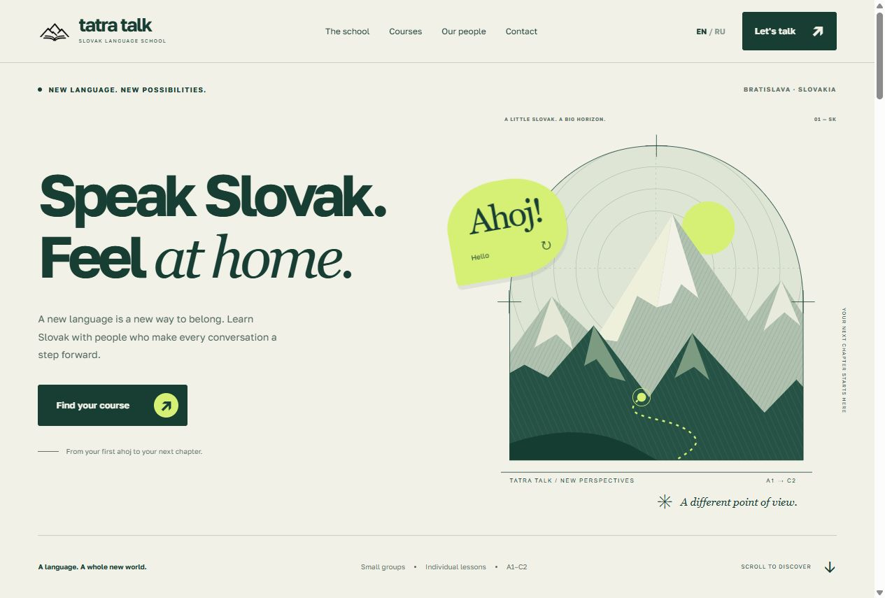
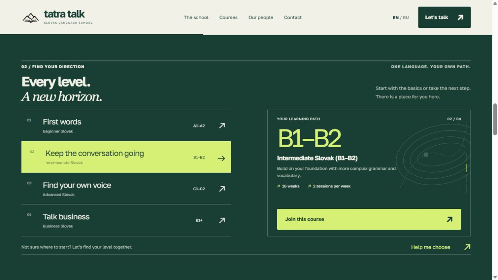

# Language school landing

**Tatra Talk** is a responsive landing page for a Slovak language school. It introduces the school and its teachers, helps visitors explore courses from A1 to C2 or Business Slovak, and invites them to enroll.

The interface is available in **English and Russian**. The design combines bold typography, a mountain illustration, forest green, and lime accents.

## Hero section



## Course explorer

On larger screens, the section stays pinned while scrolling moves the course cards through a vertical reel with subtle scaling and tilt. After a short scroll gesture, the next card settles into place. On mobile, visitors select a course by tapping.



## Features

- English and Russian language switcher.
- Four learning paths: beginner, intermediate, advanced, and Business Slovak.
- Interactive vocabulary and expandable teacher biographies.
- Responsive layouts, a mobile menu, and keyboard navigation for courses.
- Support for `prefers-reduced-motion`.
- Demo enrollment form with field validation.

> The form is a local demo: no data is submitted. Visitors can use the school's contact details to enroll.

## Getting started

Open `Index.html` in your browser. No dependencies or build step are required.

Alternatively, start a local server from the project directory:

```sh
python -m http.server 4173 --bind 127.0.0.1
```

Then visit [http://127.0.0.1:4173/Index.html](http://127.0.0.1:4173/Index.html).

## Stack and project structure

Built with **HTML, CSS, and vanilla JavaScript**, SVG graphics, and local fonts. No frameworks or external dependencies.

| File / directory | Purpose |
| --- | --- |
| `Index.html` | Page markup and SVG illustrations |
| `styles.css` | Styling, responsive layouts, and animations |
| `script.js` | Interface translations and interactions |
| `data.js` | Course, teacher, and school content |
| `Images/` | Logo and favicon |
| `fonts/` | Golos Text fonts and OFL license |
| `docs/screenshots/` | Website screenshots |
