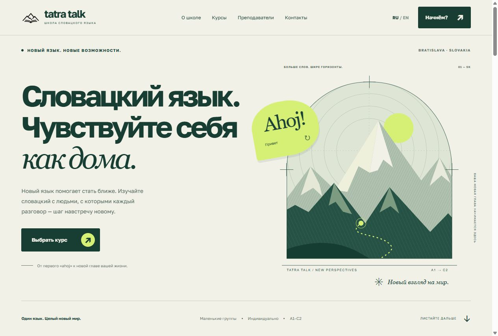

# Language school landing

**Tatra Talk** — адаптивный лендинг школы словацкого языка. Сайт знакомит со школой, помогает выбрать курс от A1 до C2 или деловой словацкий, представляет преподавателей и приглашает записаться на обучение.

Две версии интерфейса — **EN / RU**. Визуальная основа: крупная типографика, иллюстрация гор, хвойный зелёный и лаймовые акценты.

## Первый экран

### English


### Русский



## Выбор курса

На широком экране секция фиксируется во время прокрутки, а карточки справа движутся вертикальной лентой с изменением масштаба и наклона. После короткого жеста карточка плавно встаёт на место. На мобильных курс выбирается нажатием.


## Возможности

- Переключение английского и русского языка.
- Четыре направления обучения: начальный, средний, продвинутый и деловой словацкий.
- Интерактивный словарик и раскрывающиеся биографии преподавателей.
- Адаптивная вёрстка, мобильное меню и управление курсами с клавиатуры.
- Поддержка `prefers-reduced-motion`.
- Демонстрационная форма записи с проверкой полей.

> Форма работает локально: данные никуда не отправляются. Для реальной записи на сайте есть контакты школы.

## Запуск

Откройте `Index.html` в браузере — установка зависимостей и сборка не нужны.

Или запустите локальный сервер из папки проекта:

```sh
python -m http.server 4173 --bind 127.0.0.1
```

Затем откройте [http://127.0.0.1:4173/Index.html](http://127.0.0.1:4173/Index.html).

## Технологии и файлы

Чистые **HTML, CSS и JavaScript**, SVG-графика и локальные шрифты — без фреймворков и внешних зависимостей.

| Файл / папка | Назначение |
| --- | --- |
| `Index.html` | Разметка страницы и SVG-иллюстрации |
| `styles.css` | Дизайн, адаптивность и анимации |
| `script.js` | Переводы интерфейса и взаимодействия |
| `data.js` | Данные курсов, преподавателей и школы |
| `Images/` | Логотип и иконка сайта |
| `fonts/` | Golos Text и лицензия OFL |
| `docs/screenshots/` | Скриншоты сайта |
